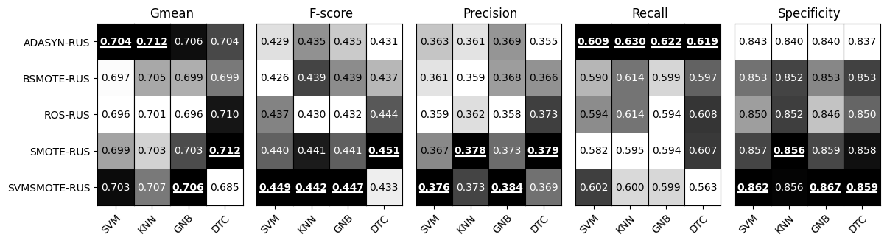
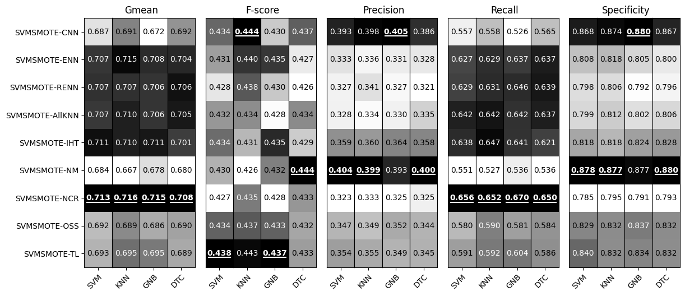
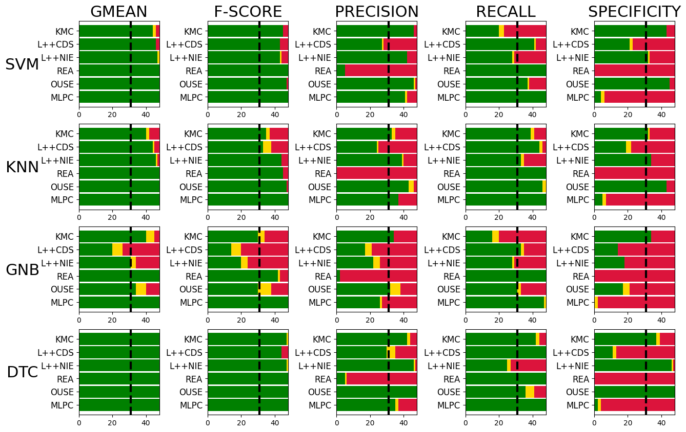

# Deterministic Sampling Ensemble

---

*Deterministic Sampling Ensemble - diagram*

*Deterministic Sampling - diagram*

---

## Experiment 1 - Evaluating the best sampling method
### Experiment files:

- [Experiment](experiment_best_sampling.py)
- [Analyze](analyze_results_best_params.py)

### Methods:

- [DSE](ensembles/dse.py) - Deterministic Sampling Ensemble

### Base classifiers:

- [Support Vector Machines](https://scikit-learn.org/stable/modules/generated/sklearn.svm.SVC.html) (SVM)
- [K-Nearest Neighbors](https://scikit-learn.org/stable/modules/generated/sklearn.neighbors.KNeighborsClassifier.html) (KNN)
- [Gaussian Naive Bayes](https://scikit-learn.org/stable/modules/generated/sklearn.naive_bayes.GaussianNB.html) (GNB)
- [Decision Tree Classifier](https://scikit-learn.org/stable/modules/generated/sklearn.tree.DecisionTreeClassifier.html) (DTC)

### Data streams:

- Generators:
  - [stream-learn](https://w4k2.github.io/stream-learn/)
  - [MOA](https://moa.cms.waikato.ac.nz/)
- Concept drift:
  - sudden
  - incremental
- Objects: 15 000
- Features: 10
- Imbalance Ratio: 10%
- Noise: 10%
- Random samples: 333

### Results:

*Results of Random Under Sampling combination with oversampling methods.  Darker is better, best value isbold and underscored*

*Results of SVMSMOTE combination with undersampling methods.  Darker is better, best value is bold andunderscored*

*Results of NCR combination with oversampling methods. Darker is better, best value is bold and underscored*

---

## Experiment 2 - Evaluating the best balance ratio param

### Files:

- [Experiment](experiment_best_balance_ratio.py)
- [Analyze](analyze_results_best_params.py)

### Methods:

- [DSE](ensembles/dse.py) - Deterministic Sampling Ensemble

### Base classifiers:

- [Support Vector Machines](https://scikit-learn.org/stable/modules/generated/sklearn.svm.SVC.html) (SVM)
- [K-Nearest Neighbors](https://scikit-learn.org/stable/modules/generated/sklearn.neighbors.KNeighborsClassifier.html) (KNN)
- [Gaussian Naive Bayes](https://scikit-learn.org/stable/modules/generated/sklearn.naive_bayes.GaussianNB.html) (GNB)
- [Decision Tree Classifier](https://scikit-learn.org/stable/modules/generated/sklearn.tree.DecisionTreeClassifier.html) (DTC)

### Data streams:

- Generators:
  - [stream-learn](https://w4k2.github.io/stream-learn/)
  - [MOA](https://moa.cms.waikato.ac.nz/)
- Concept drift:
  - sudden
  - incremental
- Objects: 15 000
- Features: 10
- Imbalance Ratio: 10%
- Noise: 10%
- Random samples: 333

### Results:

*Balance parameter setup experiment. Darker is better, best value bold and underscore*

---

## Experiment 3 - Evaluating the performance on different noise ratio data stream

### Files:

- [Experiment](experiment_exp_noise.py)
- [Analyze](analyze_results_exp_noise.py)
- [Plots](results/plots/noise_exp/)

### Methods:

- [DSE](ensembles/dse.py) - Deterministic Sampling Ensemble
- [REA](ensembles/rea.py) - [Recursive ensemble approach](https://doi.org/10.1007/s12530-010-9021-y)
- [KMC](ensembles/kmc.py) - [K-mean clustering undersampling ensemble](https://doi.org/10.1007/978-3-540-92814-0_11)
- [L++CDS](ensembles/learnppCDS.py) - [Learn++CDS](https://doi.org/10.1109/TKDE.2012.136)
- [L++NIE](ensembles/learnppNIE.py) - [Learn++NIE](https://doi.org/10.1109/TKDE.2012.136)
- [OUSE](ensembles/ouse.py) - [Over and under-sampling ensemble](https://doi.org/10.1109/MIC.2008.119)
- [MLPC](https://scikit-learn.org/stable/modules/generated/sklearn.neural_network.MLPClassifier.html) - Multi-layer perceptron classifier

### Base classifiers:

- [Support Vector Machines](https://scikit-learn.org/stable/modules/generated/sklearn.svm.SVC.html) (SVM)
- [K-Nearest Neighbors](https://scikit-learn.org/stable/modules/generated/sklearn.neighbors.KNeighborsClassifier.html) (KNN)
- [Gaussian Naive Bayes](https://scikit-learn.org/stable/modules/generated/sklearn.naive_bayes.GaussianNB.html) (GNB)
- [Decision Tree Classifier](https://scikit-learn.org/stable/modules/generated/sklearn.tree.DecisionTreeClassifier.html) (DTC)

### Data streams:

- Generator:  [stream-learn](https://w4k2.github.io/stream-learn/)
- Concept drift:  incremental
- Objects: 10 000
- Features: 10
- Imbalance Ratio: 10%
- Noise: 5%, 10%, 15%, 20%, 25%, 30%, 35%, 40%
- Random samples: 111, 222, 333, 444, 555

### Results:

*Selected mean results from noise experiments*

---

## Experiment 4 - Evaluating the performance on different balance ratio data stream

### Files:

- [Experiment](experiment_exp_balance.py)
- [Analyze](analyze_results_exp_balance.py)
- [Plots](results/plots/balance_exp/)

### Base classifiers:

- [Support Vector Machines](https://scikit-learn.org/stable/modules/generated/sklearn.svm.SVC.html) (SVM)
- [K-Nearest Neighbors](https://scikit-learn.org/stable/modules/generated/sklearn.neighbors.KNeighborsClassifier.html) (KNN)
- [Gaussian Naive Bayes](https://scikit-learn.org/stable/modules/generated/sklearn.naive_bayes.GaussianNB.html) (GNB)
- [Decision Tree Classifier](https://scikit-learn.org/stable/modules/generated/sklearn.tree.DecisionTreeClassifier.html) (DTC)

### Methods:

- [DSE](ensembles/dse.py) - Deterministic Sampling Ensemble
- [REA](ensembles/rea.py) - [Recursive ensemble approach](https://doi.org/10.1007/s12530-010-9021-y)
- [KMC](ensembles/kmc.py) - [K-mean clustering undersampling ensemble](https://doi.org/10.1007/978-3-540-92814-0_11)
- [L++CDS](ensembles/learnppCDS.py) - [Learn++CDS](https://doi.org/10.1109/TKDE.2012.136)
- [L++NIE](ensembles/learnppNIE.py) - [Learn++NIE](https://doi.org/10.1109/TKDE.2012.136)
- [OUSE](ensembles/ouse.py) - [Over and under-sampling ensemble](https://doi.org/10.1109/MIC.2008.119)
- [MLPC](https://scikit-learn.org/stable/modules/generated/sklearn.neural_network.MLPClassifier.html) - Multi-layer perceptron classifier

### Data streams:

- Generator: [stream-learn](https://w4k2.github.io/stream-learn/)
- Concept drift: incremental
- Objects: 10 000
- Features: 10
- Imbalance Ratio: 5%, 10%, 15%, 20%, 25%, 30%, 35%, 40%, 45%
- Noise: 10%
- Random samples: 111, 222, 333, 444, 555

### Results:

*Selected mean results from noise and balance experiments*

---

## Experiment 5 - Main evaluation (synthetic data)

### Files:

- [Experiment stream-learn 1 drift](experiment_main_sl_1d.py)
- [Experiment stream-learn 5 drifts](experiment_main_sl_5d.py)
- [Experiment moa 1 drift](experiment_main_moa_1d.py)
- [Experiment moa 5 drifts](experiment_main_moa_5d.py)
- [Analyze](analyze_results_main.py)
- [Plots](results/ranking_plots/)

### Base classifiers:

- [Support Vector Machines](https://scikit-learn.org/stable/modules/generated/sklearn.svm.SVC.html) (SVM)
- [K-Nearest Neighbors](https://scikit-learn.org/stable/modules/generated/sklearn.neighbors.KNeighborsClassifier.html) (KNN)
- [Gaussian Naive Bayes](https://scikit-learn.org/stable/modules/generated/sklearn.naive_bayes.GaussianNB.html) (GNB)
- [Decision Tree Classifier](https://scikit-learn.org/stable/modules/generated/sklearn.tree.DecisionTreeClassifier.html) (DTC)

### Methods:

- [DSE](ensembles/dse.py) - Deterministic Sampling Ensemble
- [REA](ensembles/rea.py) - [Recursive ensemble approach](https://doi.org/10.1007/s12530-010-9021-y)
- [KMC](ensembles/kmc.py) - [K-mean clustering undersampling ensemble](https://doi.org/10.1007/978-3-540-92814-0_11)
- [L++CDS](ensembles/learnppCDS.py) - [Learn++CDS](https://doi.org/10.1109/TKDE.2012.136)
- [L++NIE](ensembles/learnppNIE.py) - [Learn++NIE](https://doi.org/10.1109/TKDE.2012.136)
- [OUSE](ensembles/ouse.py) - [Over and under-sampling ensemble](https://doi.org/10.1109/MIC.2008.119)
- [MLPC](https://scikit-learn.org/stable/modules/generated/sklearn.neural_network.MLPClassifier.html) - Multi-layer perceptron classifier

### Data streams:

- Generators:
  - [stream-learn](https://w4k2.github.io/stream-learn/)
  - [MOA](https://moa.cms.waikato.ac.nz/)
- Concept drifts:
  - 1 sudden
  - 1 incremental
  - 5 sudden
  - 5 incremental
- Objects: 100 000
- Features: 10
- Imbalance Ratio: 10%, 20%, 30%
- Noise: 0%, 10%
- Random samples: 111, 222

### Results:

*Wilcoxon pair rank-sum tests for synthetic data streams with incremental concept drift. Dashed vertical line isa critical value with a confidence level 0.05 (green – win, yellow – tie, red – loss)*

*Wilcoxon pair rank-sum tests for synthetic data streams with sudden concept drift.  Dashed vertical line is acritical value with a confidence level 0.05 (green – win, yellow – tie, red – loss)*

---

## Experiment 5 - Main evaluation (real data)

### Files:

- [Experiment](experiment_main_real_data.py)
- [Analyze](analyze_results_main.py)
- [Plots](results/plots/real/)

### Base classifiers:

- [Support Vector Machines](https://scikit-learn.org/stable/modules/generated/sklearn.svm.SVC.html) (SVM)
- [K-Nearest Neighbors](https://scikit-learn.org/stable/modules/generated/sklearn.neighbors.KNeighborsClassifier.html) (KNN)
- [Gaussian Naive Bayes](https://scikit-learn.org/stable/modules/generated/sklearn.naive_bayes.GaussianNB.html) (GNB)
- [Decision Tree Classifier](https://scikit-learn.org/stable/modules/generated/sklearn.tree.DecisionTreeClassifier.html) (DTC)

### Methods:

- [DSE](ensembles/dse.py) - Deterministic Sampling Ensemble
- [REA](ensembles/rea.py) - [Recursive ensemble approach](https://doi.org/10.1007/s12530-010-9021-y)
- [KMC](ensembles/kmc.py) - [K-mean clustering undersampling ensemble](https://doi.org/10.1007/978-3-540-92814-0_11)
- [L++CDS](ensembles/learnppCDS.py) - [Learn++CDS](https://doi.org/10.1109/TKDE.2012.136)
- [L++NIE](ensembles/learnppNIE.py) - [Learn++NIE](https://doi.org/10.1109/TKDE.2012.136)
- [OUSE](ensembles/ouse.py) - [Over and under-sampling ensemble](https://doi.org/10.1109/MIC.2008.119)

### Data streams:

- [covtypeNorm-1-2vsAll-pruned](streams/real/covtypeNorm-1-2vsAll-pruned.arff)
- [poker-lsn-1-2vsAll-pruned](streams/real/poker-lsn-1-2vsAll-pruned.arff)

### Results:

*F-score metric over the data chunks for covtypeNorm-1-2vsAll data stream with SVM base classifier*

*F-score metric over the data chunks for poker-lsn-1-2vsAll data stream with SVM base classifier*
